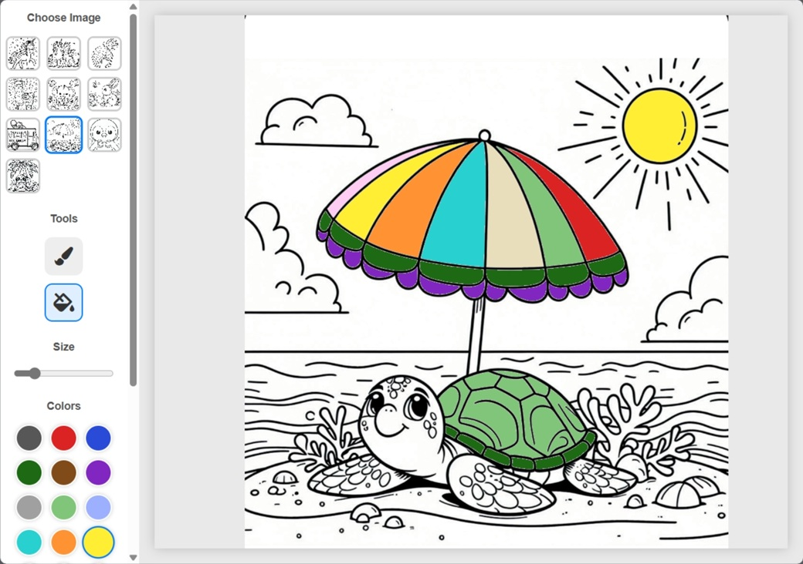

# Kids Coloring Book Web App

This is a simple, browser-based digital coloring book application built with HTML, CSS, and plain JavaScript. It uses the Konva.js library for powerful canvas manipulation, allowing users to select different images, color them using a brush or a flood-fill tool, and save their creations.

## Features

* **Image Selection**: Choose from 10 different coloring pages.
* **Color Palette**: A vibrant palette of 16 colors.
* **Brush Tool**: Free-hand drawing with an adjustable brush size slider.
* **Fill Tool**: A flood-fill tool to color large, enclosed areas with a single click.
* **Undo**: Revert the last action (works for both brush strokes and fills).
* **Clear**: Completely resets the canvas, removing all coloring.
* **Save**: Download your finished artwork as a high-resolution JPEG file.
* **Responsive Design**: The layout adapts for both desktop and mobile use.

## Installation & Setup

The preferred method for running this project is on a local server. This is **required** for the **Fill Tool** to work correctly, as modern browsers block pixel data reading (`getImageData`) from a `canvas` when the file is opened directly from the local filesystem (i.e., `file:///...`) due to security restrictions.

1.  **Download the Project**:
    * Go to the GitHub repository.
    * Click the green "Code" button and select **"Download ZIP"**.

2.  **Unzip the File**:
    * Extract the contents of the downloaded ZIP file into a folder on your computer.

3.  **Run on a Local Server**:
    * Use a simple web server application like [**Simple Web Server**](https://simplewebserver.org/) (or other solutions like VS Code's "Live Server" extension or Python's `http.server`) to serve the project folder.
    * Once running, open the provided local address (e.g., `http://localhost:8000`) in your browser to use the app.

## How to Use the App

1.  **Choose an Image**: On the left-hand toolbar, click any thumbnail under "Choose Image" to load it onto the canvas.
2.  **Select a Tool**:
    * Click the **Brush** icon (default) to draw free-hand.
    * Click the **Fill** icon to color entire sections.
3.  **Pick a Color**: Click on any color circle from the "Colors" palette. The active color will have a blue border.
4.  **Adjust Brush Size**: If you are using the Brush tool, drag the "Size" slider to make your brush larger or smaller.
5.  **Color Away!**:
    * **Brush**: Click and drag your mouse (or finger on touch devices) over the image to draw.
    * **Fill**: Click on any white, enclosed area of the image (like a flower petal or a section of a character) to fill it with the currently selected color.
6.  **Actions**:
    * **Undo**: Made a mistake? Click the "Undo" button to remove your last brush stroke or fill.
    * **Clear**: Want to start over? Click the "Clear" button to erase all your progress on the current image.
    * **Save**: Finished your masterpiece? Click the "Save" button to download a JPEG file of your work.

## Technologies Used

* **HTML5**
* **CSS3**
* **JavaScript (ES6+)**
* [**Konva.js**](https://konvajs.org/): A 2D HTML5 canvas library for high-performance drawing and interactivity.
* [**Font Awesome**](https://fontawesome.com/): Used for the icons in the toolbar.

